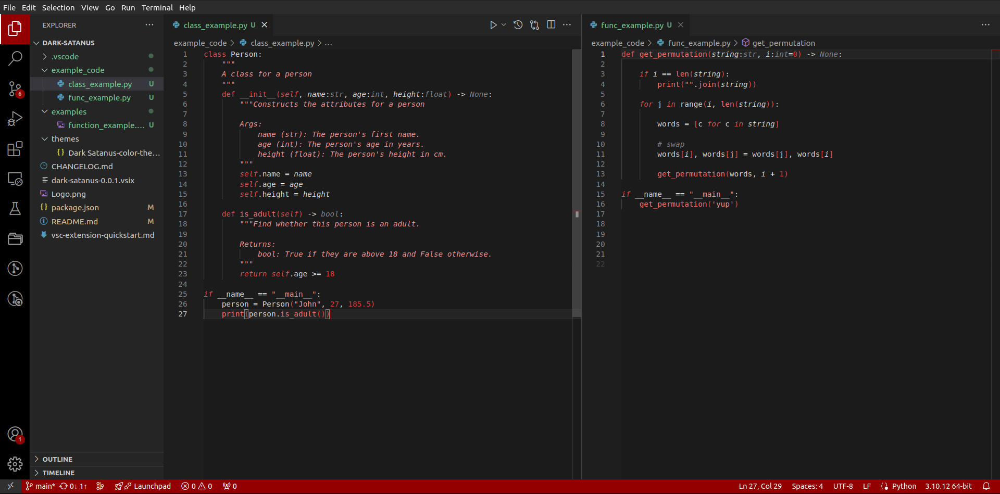
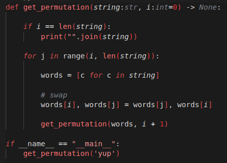
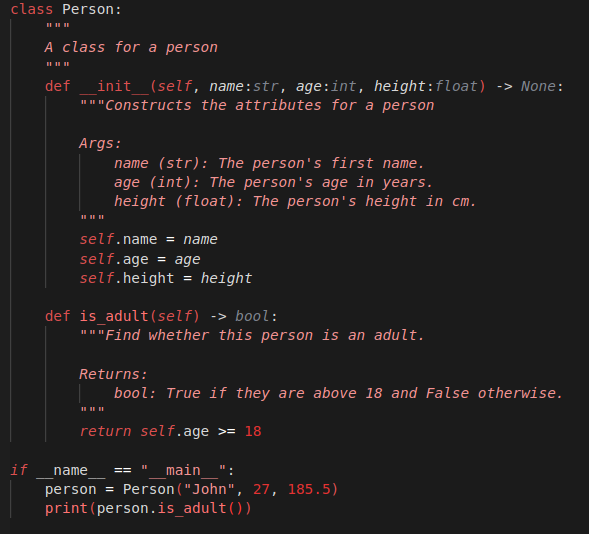

<h1 style="color:#db5050">Dark Satanus colour theme by Leonis300</h1>

This colour theme is optimised mainly for python. If there are tokens that look strangely coloured in other languages then please report it as an issue on <a href="https://github.com/Leonis300/Dark-Satanus" style="color:#db5050">github</a> and I will fix it.

<h2>Like the logo?</h2>

Please checkout Ashley Beauchemin on <a href="https://www.linkedin.com/in/ashley-beauchemin-9b7973204?utm_source=share&utm_campaign=share_via&utm_content=profile&utm_medium=ios_app" style="color:#db5050">LinkedIn</a>.

<h2>Preview</h2>
<h3>Full window</h3>

 
<h3>A Python function<h3>

 
<h3>A Python class<h3>
